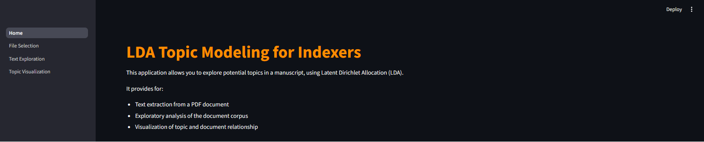
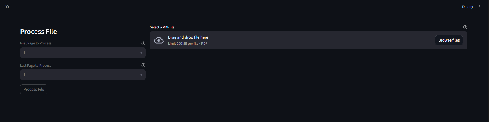
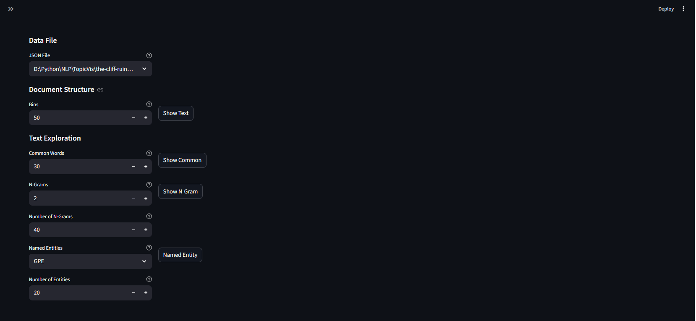
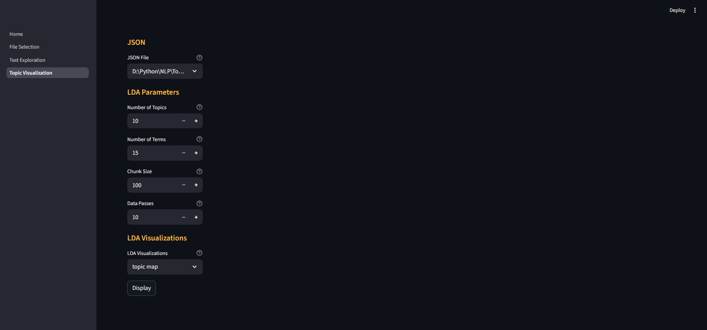

# LDA Topic Modeling for Indexers 

This application allows you to explore potential topics in a document.

It provides for:

* Text extraction from a PDF document
* Exploratory analysis of the document corpus
* Visualization of topic and document relationships

Topic generation is accomplished using [Latent Dirichlet Allocation (LDA)](https://en.wikipedia.org/wiki/Latent_Dirichlet_allocation), an unsupervised machine learning technique.

## Home Page

The **Home** page contains the page selection menu in an expandable sidebar and a short description of the application.

##  File Selection

The **File Selection** page allows you to load a PDF file and set parameters for pre-processing. This cleans the document text, converting it into a form more suitable for topic modelling.

### Display Parameters

**Select a PDF file**: Streamlit file selection widget. Files displayed in the widget are restricted to PDF. Note that, if you switch to another page then back to the File Selection page, the widget will no longer display a selected file. As long as the Currently Selected File entry shows a file name, there is a file loaded and available for pre-processing. Ideally, load and process the selected file before switching to another page.

The selected file is parsed using [SpaCy Layout](https://explosion.ai/blog/pdfs-nlp-structured-data) (a wrapper around the IBM [Docling](https://docling-project.github.io/docling/) module) to extract text spans (paragraphs) from the document. Due to the complex internal structure of a [PDF file](https://opensource.adobe.com/dc-acrobat-sdk-docs/standards/pdfstandards/pdf/PDF32000_2008.pdf), this may take some minutes. See the [PDF Association](https://pdfa.org/) for more information.

### File Processing Parameters

**First Page to Process**: The page at which you wish pre-processing to start. This should be the first page following the fore matter.

**Last Page to Process**: The page at which you wish pre-processing to end. This should be the last page before the end matter.

When the **Process File** button is pressed, the input file is processed using the parameters set by the user and a cleaned [JSON](https://en.wikipedia.org/wiki/JSON) file of text spans is created. This file is used in Text Exploration and Topic Visualization. The text processing steps undertaken are;

1. Remove URLs

2. Remove HTML

3. Remove bibliographic citations

4. Split the text into tokens

5. Filter the text for allowed parts of speech (proper nouns, nouns, verbs, adjectives, adverbs)

6. Convert text to lower case

7. Delete punctuation

8. Lemmatize the text

9. Delete stop words

[Back to Top](#top)

## Text Exploration

These text exploration techniques provide you with information about the basic structure and content of the manuscript you are indexing.

### Data File

**JSON File**: A drop-down list containing all the JSON files found in the current working directory. The drop-down defaults to the first file found.

### Document Structure

Provides basic information about the document structure, displaying characters per document and words per document. A document in this case is the equivalent of a paragraph in the manuscript. Note that pre-processing  can dramatically shorten the length of a document from its unprocessed size.

**Bins**: The number of bins used to display manuscript structure. The range is 1 - 100 with a default of 50.

### Text Exploration

#### Common Words

**Common Words**: The most common words found in the corpus of documents. The number of words displayed has a range of 1 - 100, with a default of 30.

#### N-Grams

An [n-gram](https://en.wikipedia.org/wiki/N-gram) is a sequence of *n* order specific adjacent words in a document. If you compare the N-grams created by [SpaCy](https://spacy.io/usage/spacy-101) with those generated by the [SkLearn](https://scikit-learn.org/stable/index.html) [LDA](https://scikit-learn.org/stable/modules/generated/sklearn.decomposition.LatentDirichletAllocation.html) module during topic creation, you will find that SpaCy usually produces N-grams that can be more easily interpreted.

**N-Grams**: The type of n-gram to display. An order 2 n-gram is known as a bigram, and an order-3 one as a trigram. The range for n-grams varies from 2 - 5, with a default of 2.

**Number of N-Grams**: The total number of n-grams to be displayed. These are the most common n-grams in the corpus of documents. The number of n-grams displayed can range from 1 - 100, with a default of 40.

#### Named Entities

**Named Entity**: A dropdown list containing a selection of [SpaCy](https://spacy.io/usage/spacy-101) [named entities](https://spacy.io/usage/linguistic-features#named-entities). The list defaults to GPE.

**Number of Entities**: The number of the selected named entity returned. This value has a range of 1 - 100, with a default of 20.

[Back to Top](#top)

## Topic Visualization

This page visually displays potential topics found by [SkLearn](https://scikit-learn.org/stable/index.html), using the Python module [pyLDAvis](https://pypi.org/project/pyLDAvis/) and custom visualizations.

[SkLearn](https://scikit-learn.org/stable/index.html) uses the [Latent Dirichlet Allocation (LDA)](https://en.wikipedia.org/wiki/Latent_Dirichlet_allocation) model to derive topics from a corpus of documents. Its [LatentDirichletAllocation](https://scikit-learn.org/stable/modules/generated/sklearn.decomposition.LatentDirichletAllocation.html) api takes a large number of parameters, some of which are exposed here for manipulation by the user. Since phrases are more informative in the interpretation of latent topics, model generation is restricted to use bigrams and trigrams in topic formation.

*I recommend you create a visualization with the default parameters* to see a rough approximation, then start tweaking to produce what you believe are the correct number of topics. 

### JSON

**JSON File**: A drop-down list containing all the JSON files found in the current working directory. The drop-down defaults to the first file found. 

### LDA Parameters

**Number of Topics**: The number of requested latent topics to be extracted from the training corpus. Default is 10, range is 1 - 30.

**Number of Terms**: The number of terms to display in the barcharts of the [pyLDAvis](https://pypi.org/project/pyLDAvis/) visualization. Default is 15, range is 1 - 30.

**Chunk Size**: Number of documents to be used in each training chunk. Default is 100, range is 10 - 500.

**Data Passes**: Number of passes through the corpus during training. Default is 10, range is 1 - 50.

LDA Visualizations

A dropdown list allowing for the selection of one of the following visualization methods.

**topic map**: a 2-dimensional [pyLDAvis](https://pypi.org/project/pyLDAvis/) visualization of the topics generated by [LatentDirichletAllocation](https://scikit-learn.org/stable/modules/generated/sklearn.decomposition.LatentDirichletAllocation.html).

**topic similarity**: a [Plotly](https://plotly.com/python/) [heatmap](https://plotly.com/python/heatmaps/) of the relationship between topics. The darker the color of the square, the more closely related the topics.

 **topic barchart**: a grid of [Plotly](https://plotly.com/python/) [bar charts](https://plotly.com/python/bar-charts/) with a chart for each topic showing the top 5 terms in the topic.

**topic clouds**: a [Matplotlib](https://matplotlib.org/) grid of [wordclouds](https://en.wikipedia.org/wiki/Tag_cloud) with a cloud for each topic showing the top 10 words in each topic.

**topic sunburst**: a [Plotly](https://plotly.com/python/) [sunburst chart](https://plotly.com/python/sunburst-charts/) showing the relative importance of both topics and most common words within a topic.

**topic treemap**: a [Plotly](https://plotly.com/python/) [treemap chart](https://plotly.com/python/treemaps/) showing the relative importance of both topics and most common words within a topic

**document topics**: a [Plotly](https://plotly.com/python/) [bar chart](https://plotly.com/python/bar-charts/) showing the corpus of documents grouped by the dominant topic within each document.

**documents**: a [Plotly](https://plotly.com/python/) [2-dimensional](https://plotly.com/python/line-and-scatter/) scatter plot of the corpus of documents, color-coded by the dominant topic in each document. Dimension reduction to 2-D done using [Scikit Learn](https://scikit-learn.org/0.16/index.html) [t-SNE](https://scikit-learn.org/stable/modules/generated/sklearn.manifold.TSNE.html).

**3-D document topics**: a [Plotly](https://plotly.com/python/) [3-dimensional](https://plotly.com/python/3d-scatter-plots/) scatter plot of the corpus of documents, color-coded by the dominant topic in each document. Dimension reduction to 3-D done using [Scikit Learn](https://scikit-learn.org/0.16/index.html) [t-SNE](https://scikit-learn.org/stable/modules/generated/sklearn.manifold.TSNE.html).

**cluster map**: a [Plotly](https://plotly.com/python/) [cluster map](https://plotly.github.io/plotly.py-docs/generated/plotly.figure_factory.create_dendrogram.html#plotly.figure_factory.create_dendrogram) showing the relationship between topics. Allows for the examination of higher order groupings of topics.

[Back to Top](#top)
